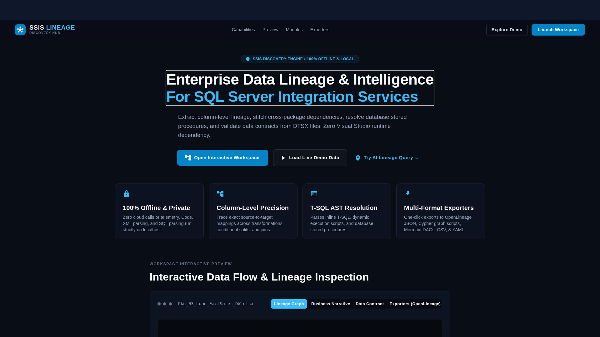
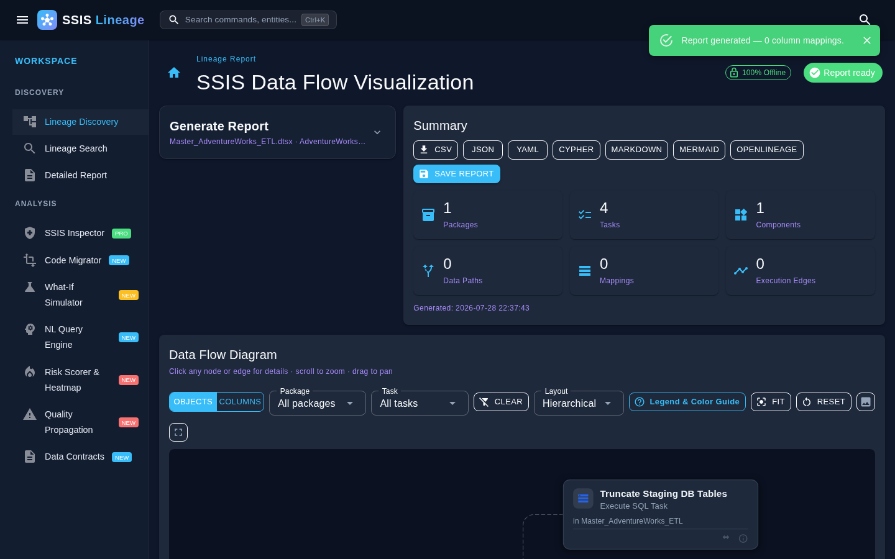
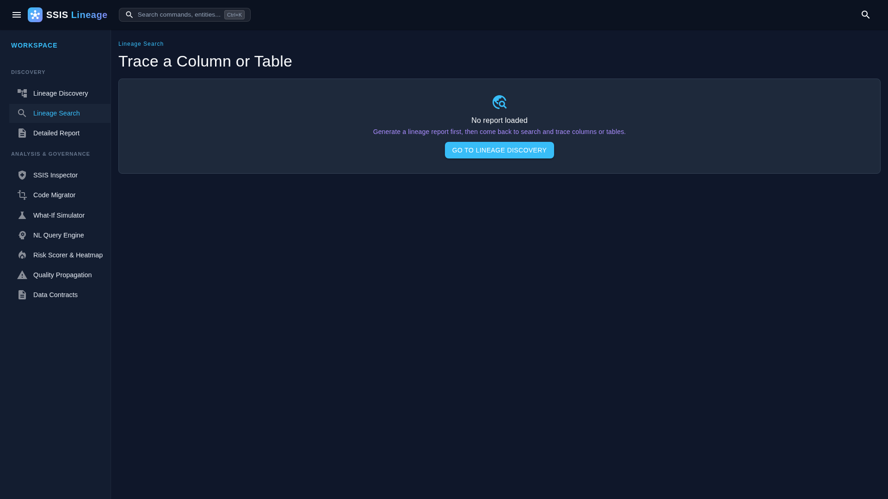

# SSIS Lineage Discovery Hub

[](LICENSE)
[](https://dotnet.microsoft.com/download/dotnet/10.0)
[](#privacy--offline)

A professional, offline-first data lineage discovery engine that scans Microsoft SSIS projects (`.dtproj` / `.dtsx`), builds interactive data-flow graphs, enriches mappings using SQL Server stored procedures, and exports multiple documentation formats.

Features a modernized **Landing Page Dashboard** and a streamlined, responsive workspace configuration sidebar.

---

## 📸 Screenshots & Interface Preview

### 1. Landing Page Portal & Intelligence Hub


### 2. Interactive Data Flow Visualization & Workspace


### 3. Column/Table Lineage Trace (Impact & Origins)


---

## 🌟 Key Features

*   **Decoupled Landing Page**: Serves as a clean entry portal featuring quick-launch actions, live project overview statistics, and sample tutorial datasets.
*   **Interactive Lineage Visualization**: Zoomable Cytoscape-powered graphs mapping packages, control flow tasks, components, and column-level origins.
*   **Modern Workspace Sidebar**: Integrated with MudBlazor expansion panels to collapse database connection overrides and advanced settings, keeping workspaces clean and compact.
*   **Business Narratives**: Auto-generates natural language summaries for packages and columns.
*   **100% Offline Parsing**: Zero cloud calls, telemetry, or external API requirements. All package XML parsing and SQL AST resolution are done locally.
*   **Multi-Format Export**: One-click exports for CSV, Excel, JSON, YAML, Neo4j Cypher, Mermaid, and OpenLineage.

---

## 🚀 Getting Started (Linux / macOS / Windows)

### Running on Linux / macOS (Local Server)
We have included a startup script to clean occupied ports and launch the web interface instantly:

```bash
# 1. Clone your repository
git clone <your-repo-url>
cd <your-repo-name>

# 2. Make the script executable and run
chmod +x run.sh
./run.sh
```

Open your browser to `http://localhost:5057` to explore the portal!

### Setup & Running on Windows (Desktop Application)
To resolve the native SQL Server DTS assemblies, use the following steps:

```powershell
# 1. Install .NET 10 SDK
winget install Microsoft.DotNet.SDK.10

# 2. Copy SSIS runtime DLLs into local references
powershell -ExecutionPolicy Bypass -File setup-ssis-refs.ps1

# 3. Launch native desktop host
dotnet run --project src/SsisLineage.Desktop -c Release
```

### ☁️ Cloud Deployment (Free Hosting)
You can deploy the web version of this application 100% for free using the included `Dockerfile`. 
For step-by-step instructions on deploying to zero-cost providers like Render or Koyeb, see our **[Free Deployment Guide](docs/FREE_DEPLOYMENT_GUIDE.md)**.

---

## 🛠 What gets parsed

| Area | Coverage |
|------|----------|
| **Control Flow** | Execute SQL Task, Execute Package Task (recursive child packages), Data Flow Task, Sequence / ForEach / ForLoop containers, precedence constraints |
| **Data Flow** | All pipeline components and paths; declared input/output column mappings; OLE DB source/destination table or SQL command; Lookup SQL |
| **Inline SQL** | `INSERT…SELECT`, `SELECT INTO`, `UPDATE` (incl. `FROM…JOIN`), `DELETE` (target + join + filter), `MERGE` (insert/update actions, ON condition), CTEs (`WITH…`), `INSERT…EXEC`, `UNION` |
| **Dynamic SQL** | `EXEC(@var)` and `EXEC sp_executesql @var` — variable assignments (`SET @sql = '…' + ...`) are reconstructed, parameters substituted, and the inner SQL re-parsed |
| **Stored Procedures** | With *enrich data-flow SQL procedures* enabled, proc bodies are loaded from SQL Server (via project `.conmgr` connections or an override) and parsed with the full SQL grammar |

---

## 📁 Solution Layout

| Project | Purpose |
|---------|---------|
| `src/SsisLineage.Core` | Lineage engine (parse, cache, SQL enrich, exports) |
| `src/SsisLineage.Cli` | Console `scan` command & CI diff runner |
| `src/SsisLineage.UI` | Shared Razor Class Library — MudBlazor UI, interactive Cytoscape DAG, services |
| `src/SsisLineage.Web` | Thin Blazor Server host (browser, for dev/advanced use) |
| `src/SsisLineage.Desktop` | Photino native desktop host (primary app — no web server, no open port) |
| `src/SsisLineage.Tests` | Unit tests (parsing and HTML anchors) |

---

## 🔒 Privacy & Security

*   **Fully Offline**: Connection strings, metadata, and schemas are handled purely inside your local runtime.
*   **Credential Redaction**: Connection password values and secrets are automatically removed before exporting or printing reports.

---

## 📄 License

Distributed under the [MIT License](LICENSE).
