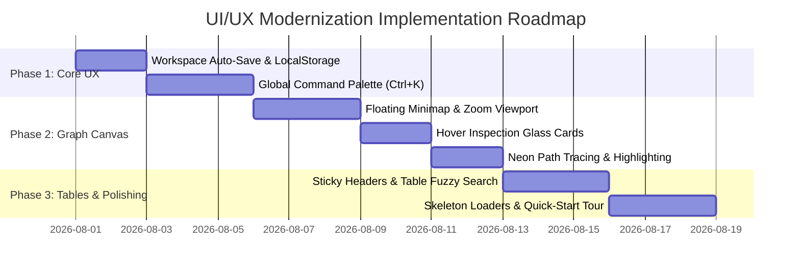

# 📄 Product Requirement Document (PRD): UI/UX Overhaul & Modernization

> **Document Title:** SSIS Lineage Hub — Enterprise UI/UX Modernization & Design System PRD  
> **Document Version:** 2.0.0  
> **Date:** July 27, 2026  
> **Status:** Approved / Ready for Implementation  
> **Author:** Antigravity AI Lead UX Architect & Product Team  
> **Target Audience:** Frontend Engineers, UI/UX Designers, Product Managers, Data Governance Teams  

---

## 🎯 1. Executive Summary & Product Vision

**SSIS Lineage Hub** is an offline-first enterprise platform designed for scanning, parsing, visualizing, and governing SQL Server Integration Services (SSIS) packages, SQL stored procedures, and complex ETL pipelines. 

While the underlying parsing engine and analytical features (such as Data Quality Propagation, What-If Simulation, and Data Contract Validation) are highly functional, **the current User Interface (UI) and User Experience (UX) require modernization** to meet modern SaaS standards (like Datadog, DataHub, and Linear).

### 📋 Primary Objectives of UI/UX Overhaul
1. **Reduce Friction & Navigation Time:** Enable instantaneous entity lookup (packages, tables, columns, procedures) across the entire application using a global Command Palette (`Ctrl + K`).
2. **Elevate Diagram Canvas Ergonomics:** Provide smooth, intuitive graph navigation with a floating Minimap, hover glassmorphism inspection cards, layout algorithms, and neon path highlighting for 100+ node graphs.
3. **Enhance Data Density & Readability:** Improve high-density table views with sticky headers, fuzzy column searching, and one-click code exporting (Mermaid, SQL, JSON, Cypher).
4. **Unified Enterprise Design System:** Establish consistent color tokens (Risk Matrix, Health Status, Dark/Light theme glassmorphism) and responsive micro-interactions with skeleton loading states.
5. **Seamless Onboarding & State Persistence:** Automatic persistence of user workspace settings (LocalStorage) and guided quick-start tours for first-time data architects.

---

## 🔍 2. Current UX Pain Points & Problem Statements

| # | Pain Point / Friction | Impact | Proposed UX Fix |
|---|---|---|---|
| **P1** | **No Global Search:** Users must manually navigate between pages or scroll through massive drop-down menus to locate a specific SSIS package or database column. | High | **Global Command Palette (`Ctrl + K`)** with fuzzy instant filtering and keyboard shortcuts. |
| **P2** | **Graph Disorientation on Large Scans:** When zooming into dense 50+ node graphs in Cytoscape, users lose context of the whole lineage architecture. | High | **Interactive Canvas Minimap Navigator** + **Hover Inspection Glass Cards**. |
| **P3** | **Manual Re-entry of Parameters:** Refreshing the page resets inputs like project path, connection strings, and filter choices. | Medium | **LocalStorage Workspace Auto-Save** & multi-profile preset manager. |
| **P4** | **Abrupt Page Loading States:** Heavy graph parsing and SQL analysis lack progressive loading indicators, leading to perceived UI unresponsiveness. | Medium | **Skeleton Loaders** & progressive step-by-step progress cards. |
| **P5** | **Table Visual Overload:** Detailed report tables have high row counts without sticky headers, inline column search, or quick-copy triggers. | Medium | **Sticky-Header Data Grids** with inline filter chips and direct copy action buttons. |

---

## 🎨 3. Detailed Functional Requirements (UI/UX Specification)

### 3.1 Global Command Palette (`Ctrl + K` / `Cmd + K`)
- **Behavior:** Pressing `Ctrl + K` (or clicking a persistent search trigger in the top navbar) opens a spotlight modal overlay.
- **Search Scope:**
  - **Pages & Modules:** Quick navigate to *Lineage Scanner, Detailed Report, Quality Propagation, Data Contracts, What-If Simulator, Risk Heatmap, NL Query*.
  - **Lineage Entities:** Instantly search packages (`.dtsx`), tables (`stg.Customer`), columns (`CustomerKey`), and stored procedures (`sp_LoadFact`).
  - **Quick Actions:** *Export PNG, Download CSV, Switch Dark/Light Theme, Toggle Demo Mode*.
- **UI Styling:** Glassmorphism overlay (`backdrop-filter: blur(8px)`), keyboard shortcut hints (`↑`, `↓`, `Enter`, `Esc`), highlighted match substrings.

### 3.2 Cytoscape Diagram Canvas Ergonomics (`Lineage.razor`)
- **3.2.1 Floating Minimap Navigator:**
  - Located in the bottom-right corner of the canvas.
  - Displays a miniature preview of the entire graph with a highlighted viewport rectangle indicating the active visible zoom area.
  - Interactive: Dragging the viewport rectangle pans the main canvas.
- **3.2.2 Hover Inspection Glass Card:**
  - When hovering over any node or edge for >200ms, display a sleek floating popover card.
  - Shows node type icon, full name, input/output degree, parent package, schema, and current risk score.
- **3.2.3 Neon Path Tracing & Highlight:**
  - Clicking a column or table node automatically highlights its complete upstream lineage (sources) in **Neon Cyan (`#06B6D4`)** and downstream impact in **Neon Amber (`#F59E0B`)**, while dimming unrelated nodes.
- **3.2.4 Layout Switcher & High-Res Export:**
  - Quick toolbar buttons to toggle layout algorithms: **Dagre (Hierarchical)**, **Cola (Force-directed)**, **Concentric**, and **Grid**.
  - One-click SVG Vector & A3 PDF Export button.

### 3.3 Data Density & Table Interactivity (`DetailedReportPage.razor`)
- **Sticky Table Headers:** Table headers remain fixed at the top during vertical scrolling.
- **Inline Multi-Column Search & Quick Filters:** Search fields with instant filtering per column (e.g., filter by transformation operation `OLE DB Source`, `Derived Column`, `Lookup`).
- **Code Snippet Quick Exporters:** One-click copy buttons for export formats:
  - **Mermaid flowchart syntax**
  - **Neo4j Cypher queries**
  - **OpenLineage JSON payloads**
  - **Markdown & CSV**

### 3.4 Micro-Interactions, Feedback & Skeleton States
- **Skeleton Loaders:** Replace raw spinners with animated skeleton placeholders matching the exact card/grid layout during scan & parse operations.
- **Toast / Snackbar Notifications:** Standardized MudBlazor snackbars for background operations (e.g., *"Report generated: 1,420 mappings found"*, *"Connection test successful"*).
- **Status Color Palette Consistency:**
  - 🟢 **Safe / Normal:** Emerald Green (`#10B981`)
  - 🔵 **Informational:** Cyber Blue / Cyan (`#06B6D4`)
  - 🟡 **Warning / Moderate Risk:** Amber Yellow (`#F59E0B`)
  - 🔴 **Critical / Broken Lineage:** Rose Red (`#EF4444`)

### 3.5 Onboarding & First-Time User Experience (FTUE)
- **Guided Feature Tour:** Step-by-step interactive tooltip walkthrough for new users explaining scan setup, graph exploration, and impact simulation.
- **Rich Empty States:** Empty states across all sub-pages feature an immediate **"Load Demo Dataset"** CTA button so users can explore functionality instantly without uploading files first.

---

## 🖼️ 4. UI Layout & Wireframe Specifications

```
+-----------------------------------------------------------------------------------+
|  [Logo] SSIS Lineage Hub   |  🔍 Search entities... (Ctrl+K)   | 🌙 Theme | 👤 User|
+-----------------------------------------------------------------------------------+
| NAV DRAWER     | MAIN WORKSPACE CANVAS                                           |
| --------------------------------------------------------------------------------- |
| 📊 Overview    | [ Top Bar: Package Path | Start Package | [⚡ Generate Scan] ]    |
| 🕸️ Lineage     | +-------------------------------------------------------------+ |
| 📋 Detailed    | | GRAPH CANVAS (Cytoscape.js)                                | |
| 🛡️ Contracts   | |                                                             | |
| 🧪 Simulator   | |   [ Source Table ] ---> ( ETL Task ) ---> [ Target Table ]  | |
| 🌡️ Heatmap     | |                                                             | |
| 💬 NL Assistant| |                                            +--------------+ | |
|                | |                                            | MINIMAP      | | |
|                | |                                            | [  Viewport ]| | |
|                | |                                            +--------------+ | |
|                | +-------------------------------------------------------------+ |
|                | [ Bottom Stats: 12 Packages | 85 Tasks | 1,420 Column Mappings ] |
+-----------------------------------------------------------------------------------+
```

---

## ⚡ 5. Non-Functional UI/UX Requirements

1. **Performance & Frame Rate:**
   - Graph pan/zoom rendering must maintain **60 FPS** up to 300 nodes.
   - Command Palette overlay search latency must be **< 50ms**.
2. **Accessibility (WCAG 2.1 Level AA):**
   - High contrast ratio (> 4.5:1) for all body text and code snippets in both Dark and Light modes.
   - Full keyboard navigation support (`Tab`, `Arrow keys`, `Enter`, `Escape`).
3. **Responsiveness:**
   - Responsive layout adapting gracefully down to tablet resolutions (1024x768) and desktop wide screens (1920x1080+).

---

## 🚀 6. Phased Implementation Roadmap



---

## 📈 7. Key Success Metrics (KPIs)

- **Time-to-Insight Reduction:** 50% decrease in time required for architects to trace a column from target table back to source package (from ~60s down to <15s using `Ctrl+K`).
- **User Engagement & Adoption:** 80%+ utilization of natural language and command palette features among active users.
- **Task Success Rate:** 100% completion rate for zero-configuration demo exploration by first-time users via the FTUE guided walkthrough.

---
*End of PRD Document — SSIS Lineage Hub UI/UX Overhaul 2026*
