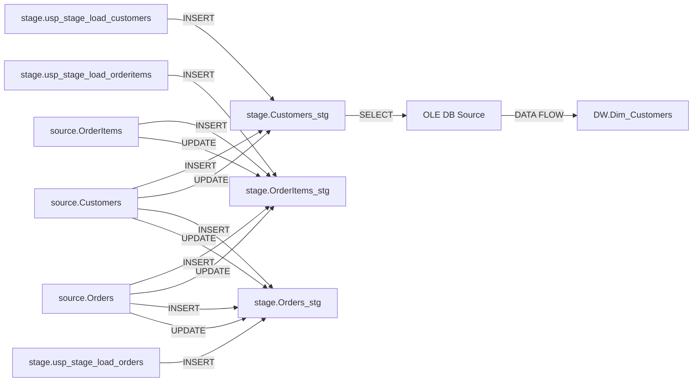

# Sample report — e-commerce data warehouse

A complete lineage report generated from a **synthetic** SSIS project: a small
e-commerce data warehouse that stages `Customers`, `Orders`, and `OrderItems` from a
`source` schema into `stage` tables and loads them into `DW` dimensions/facts.

No real data, no credentials (connections use integrated security against a local SQL
instance), and exports redact any credential values automatically.

## Table-level flow



## Files

| File | Format | How to view |
|---|---|---|
| [`lineage-report.html`](lineage-report.html) | Standalone HTML report | Open in a browser |
| [`lineage.json`](lineage.json) | Lineage graph | **Load Lineage (JSON)…** in the extension, or the app's load-report |
| [`lineage.yaml`](lineage.yaml) | Lineage graph (YAML) | Any editor |
| [`lineage.cypher`](lineage.cypher) | Neo4j import | `cypher-shell` / Neo4j Browser |
| [`lineage.mmd`](lineage.mmd) | Mermaid flowchart | Renders above; or any Mermaid viewer |
| [`execution-flow.md`](execution-flow.md) | Execution-flow report | Markdown preview |
| [`lineage.openlineage.json`](lineage.openlineage.json) | OpenLineage run events | Marquez / Purview / DataHub ingestion |

## How it was generated

```bash
ssis-lineage scan --project-path <SsisProject> --start-package Stage.dtsx \
  --include-sql-procedures --output samples/ecommerce-dw
```

`Stage.dtsx` is the master package (it calls `DW_Load.dtsx` via an Execute Package
Task), so a single scan from it produces the full `source → stage → DW` chain.
